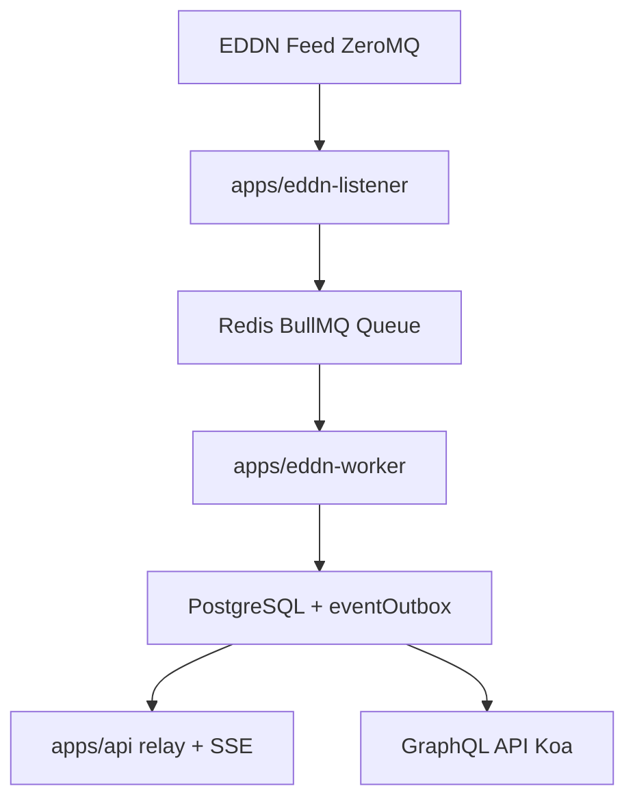

# EliteHub Vault

EliteHub Vault is a real-time data collection and processing system for Elite Dangerous. It processes player-submitted events sent over the [EDDN (Elite Dangerous Data Network)](https://github.com/EDCD/EDDN), stores game state in a PostgreSQL database, serves it via a GraphQL API, and publishes selected realtime updates over SSE.

Support the development of this project by [buying me a coffee](https://buymeacoffee.com/jovanblazek).

[](https://buymeacoffee.com/jovanblazek)

<a href="https://discord.gg/QR6Vg3J7zf" target="_blank">
  
</a>

## Table of Contents

- [Why another data collection system?](#why-another-data-collection-system)
- [Usage For API Consumers](#usage-for-api-consumers)
  - [Authentication](#authentication)
  - [API Endpoints](#api-endpoints)
  - [Using The GraphQL API](#using-the-graphql-api)
  - [Realtime SSE Endpoint](#realtime-sse-endpoint)
  - [Rate Limits](#rate-limits)
  - [Support](#support)
- [For Contributors](#for-contributors)
- [Roadmap](#roadmap)
- [License](#license)
- [Credits](#credits)

## Why another data collection system?

There are already several websites and services for Elite Dangerous that provide similar data and functionality. However, most of them lack an API for BGS related data that is comprehensive and well documented.

After EliteBGS started to have frequent availability issues with their API, I decided to build my own data collection system and API.

## Usage For API Consumers

EliteHub Vault provides:

- a **read-only GraphQL API** with Elite Dangerous galaxy data (systems, factions, stations, powerplay, conflicts)
- a **real-time SSE stream** for selected powerplay and faction updates

### Authentication

EliteHub Vault has a small free tier for GraphQL queries. You can call `POST /graphql` without an API key for light usage.

If you need higher GraphQL limits or access to the realtime SSE stream, request an **API key** and send it in the `X-API-Key` header:

```bash
curl -H "X-API-Key: your-api-key" https://vault.elitehub.eu/graphql
```

Join the [support server on Discord](https://discord.gg/QR6Vg3J7zf), or create an [issue](https://github.com/jovanblazek/elitehub-vault/issues/new) to obtain an API key.

### API Endpoints

```
POST /graphql
GET /graphql (for GraphiQL playground, open in your browser)
GET /realtime/sse
```

### Using The GraphQL API

If you have not used GraphQL before, the short version is: you ask for exactly the fields you want, and the API returns data in the same shape.

Use `POST /graphql` for requests from your application, script, or backend.

Use `GET /graphql` when you want the interactive GraphiQL explorer. You can view it by opening the API URL directly in your browser. GraphiQL is available in production, so you can inspect the schema, discover available fields, and test queries before writing code. If you define the `X-API-Key` header in GraphiQL, you can also run queries there directly.

For small-scale usage, you can query the GraphQL API without an API key. If you need higher request limits, use an API key.

Typical workflow:

1. Open `https://vault.elitehub.eu/graphql` in your browser.
2. Explore the schema in GraphiQL and find the field you want.
3. Build a query with only the fields you need.
4. Run the same query from your application with `POST /graphql` and your API key.

Example query (get all conflicts for the faction "Anti Xeno Initiative"):

```graphql
query MyQuery {
  factionByName(name: "Anti Xeno Initiative") {
    id
    name
    factionConflicts {
      edges {
        node {
          id
          factionWonDays
          opponentWonDays
          opponentFaction {
            id
            name
          }
          system {
            name
          }
        }
        cursor
      }
    }
  }
}
```

Example response:

```json
{
  "data": {
    "factionByName": {
      "id": "51acfdae-4d60-4ebe-a564-ef65dccad913",
      "name": "Anti Xeno Initiative",
      "factionConflicts": {
        "edges": [
          {
            "node": {
              "id": "2d5348b3-df9b-4434-b2f9-b5f165cec523",
              "factionWonDays": 3,
              "opponentWonDays": 2,
              "opponentFaction": {
                "id": "999be1f9-c035-483c-bb47-a243ee344f9b",
                "name": "OrioN Navy"
              },
              "system": {
                "name": "LHS 2"
              }
            },
            "cursor": "WyI2NjhkNWYxYWE2IiwiMmQ1MzQ4YjMtZGY5Yi00NDM0LWIyZjktYjVmMTY1Y2VjNTIzIl0="
          },
          {
            "node": {
              "id": "3aaacd25-1dab-4538-b9c0-f83ce8cf5dd4",
              "factionWonDays": 0,
              "opponentWonDays": 0,
              "opponentFaction": {
                "id": "d1061512-78c8-4bba-80a8-d262a5d6f462",
                "name": "Noblemen of LHS 475"
              },
              "system": {
                "name": "Crucis Sector VJ-R a4-2"
              }
            },
            "cursor": "WyI2NjhkNWYxYWE2IiwiM2FhYWNkMjUtMWRhYi00NTM4LWI5YzAtZjgzY2U4Y2Y1ZGQ0Il0="
          }
        ]
      }
    }
  }
}
```

The response mirrors the query structure:

- `factionByName` is the top-level field you requested
- `id` and `name` are returned directly on that faction
- `factionConflicts.edges` contains related conflict records
- each `node` contains the conflict fields you asked for, plus nested `opponentFaction` and `system` objects

Minimal `curl` example:

Without API key:

```bash
curl https://vault.elitehub.eu/graphql \
  -H "Content-Type: application/json" \
  -d '{"query":"query MyQuery { factionByName(name: \"Anti Xeno Initiative\") { id name factionConflicts { edges { node { id factionWonDays opponentWonDays opponentFaction { id name } system { name } } cursor } } } }"}'
```

With API key for higher limits:

```bash
curl https://vault.elitehub.eu/graphql \
  -H "Content-Type: application/json" \
  -H "X-API-Key: your-api-key" \
  -d '{"query":"query MyQuery { factionByName(name: \"Anti Xeno Initiative\") { id name factionConflicts { edges { node { id factionWonDays opponentWonDays opponentFaction { id name } system { name } } cursor } } } }"}'
```

### Realtime SSE Endpoint

`GET /realtime/sse` opens a long-lived `text/event-stream` response. Every connection must include:

- an API key in the `X-API-Key` header
- `eventType=<type>` parameter
- one or more routing key parameters from table below

Supported search params:

| Param       | Required                         | Applies to                                                                     | Notes                                                                                                           |
| ----------- | -------------------------------- | ------------------------------------------------------------------------------ | --------------------------------------------------------------------------------------------------------------- |
| `eventType` | yes                              | all SSE subscriptions                                                          | One of `systemPowerplayUpdated`, `factionPresenceChanged`, `factionStateChanged`, `factionControlThreatChanged` |
| `powerId`   | yes for `systemPowerplayUpdated` | powerplay events                                                               | Repeat `1-4` times                                                                                              |
| `factionId` | yes for faction events           | `factionPresenceChanged`, `factionStateChanged`, `factionControlThreatChanged` | Repeat `1-20` times                                                                                             |
| `systemId`  | no                               | all SSE subscriptions                                                          | Repeat up to `20` times to further narrow events to specific systems                                            |

Notes:

- stream uses standard SSE framing with `retry`, comment frames, `id`, `event`, and `data`
- keepalive comments are emitted periodically to keep idle connections open

Quick start:

```bash
curl -N \
  -H "X-API-Key: your-api-key" \
  -H "Accept: text/event-stream" \
  "https://vault.elitehub.eu/realtime/sse?eventType=systemPowerplayUpdated&powerId=<power-id>"
```

General SSE frame example:

```text
retry: 2000

: connected

id: 1
event: systemPowerplayUpdated
data: {"event":"systemPowerplayUpdated","systemId":"<system-id>","powerId":"<power-id>","changedFields":["powerplayState"],"timestamp":"2026-02-07T00:00:00.000Z","metadata":{}}

: keepalive
```

Supported event types:

- `systemPowerplayUpdated`
- `factionPresenceChanged`
- `factionStateChanged`
- `factionControlThreatChanged`

Common error responses:

- `400` invalid/missing subscription query params
- `401` missing/invalid API key
- `429` max concurrent SSE connections reached for the API key

Event payloads are sent in the SSE `data` field as JSON and are intentionally lean. Use the stream to detect that something changed, then call the GraphQL API if you need more details or the current complete data for the affected entity. For full payload schemas, event-specific examples, semantics, and runtime behavior, see [docs/sse.md](docs/sse.md).

### Rate Limits

- **GraphQL free tier:** limited anonymous access for light usage
- **GraphQL with API key:** higher per-key request limits
- **SSE:** concurrent connection limit per API key
- Rate limit headers are included in GraphQL responses

### Support

For issues or questions, please open an [issue](https://github.com/jovanblazek/elitehub-vault/issues/new) or join the [support server on Discord](https://discord.gg/QR6Vg3J7zf).

## For Contributors

This repository uses a Turborepo monorepo with applications under `apps/*` and shared libraries under `packages/*`.

### Prerequisites

- **Node.js** 22.14.0 or higher
- **pnpm** 9.x or higher
- **Docker** and Docker Compose (for local database)

### Quick Start

1. **Clone the repository:**

   ```bash
   git clone https://github.com/jovanblazek/elitehub-vault.git
   cd elitehub-vault
   ```

2. **Install dependencies:**

   ```bash
   pnpm install
   ```

3. **Set up environment:**

   ```bash
   cp .env.example .env
   # Edit .env with your configuration
   ```

4. **Start database services:**

   ```bash
   pnpm docker:up
   ```

5. **Run database migrations:**

   ```bash
   pnpm drizzle:migrate
   ```

6. **Start development pipeline:**
   ```bash
   pnpm dev
   ```

`pnpm dev` runs the development pipeline through Turbo. In practice, that starts the three apps and any shared packages that they depend on.

The GraphQL API will be available at `http://localhost:3000/graphql`. Replace the port with the one specified in your `.env` file.

### Development Commands

```bash
pnpm dev                 # Run all workspace dev tasks through Turbo
pnpm dev:api             # Run apps/api and its local dependencies
pnpm dev:eddn-listener   # Run apps/eddn-listener and its local dependencies
pnpm dev:eddn-worker     # Run apps/eddn-worker and its local dependencies
pnpm typecheck           # Type check the code
pnpm build               # Build all apps and packages
pnpm format              # Format all code with Prettier
pnpm lint                # Lint code with Oxlint
pnpm drizzle:generate    # Delegate to packages/db and generate migrations
pnpm drizzle:migrate     # Delegate to packages/db and run migrations
pnpm drizzle:studio      # Delegate to packages/db and open Drizzle Studio

# Docker
pnpm docker:up           # Start PostgreSQL + Redis
pnpm docker:down         # Stop services
```

### Architecture Overview



**Component Responsibilities:**

- `apps/api/` - Koa API, PostGraphile, SSE, auth, and outbox relay
- `apps/eddn-listener/` - EDDN listener application that consumes ZeroMQ messages and enqueues BullMQ jobs
- `apps/eddn-worker/` - worker application that processes BullMQ jobs and updates the database
- `packages/db/` - shared Drizzle schema, migrations, and DB helpers
- `packages/eddn-contracts/` - shared EDDN message types and filters
- `packages/queue-contracts/` - shared queue names, job payloads, and realtime contracts
- `packages/runtime-config/` - shared env loading, Redis, logger, and Sentry factories
- `packages/typescript-config/` - shared base TypeScript config

### Code Style

- Use **ES modules** (`.js` extensions in imports, even for `.ts` files)
- **Destructure imports** when possible: `import { foo } from 'bar'`
- Create process-local runtime instances from shared factories; do not share live Redis/BullMQ/DB instances across apps
- **Prefix logs** with component name: `logger.info('[ComponentName] Message')`
- **All database operations** via Drizzle ORM
- Use `db.transaction()` for multi-step database operations
- Run lint and format commands before committing

### Workflow

1. Make your changes
2. Run `pnpm typecheck` to verify types
3. Test your changes locally, using `pnpm dev`
4. Run `pnpm lint` and `pnpm format` to check for linting and formatting errors
5. Commit with descriptive messages

When done, open a pull request to the main branch.

### Database Migrations

Database commands are owned by `packages/db`. You can run them either from the workspace root via the convenience wrappers in `package.json`, or directly inside `packages/db`.

When done modifying the schema in `packages/db/src/schema.ts`:

1. **Generate migration:**

   ```bash
   pnpm drizzle:generate
   ```

   Equivalent direct package command:
   `cd packages/db && pnpm drizzle:generate`

2. **Review generated SQL** in `packages/db/drizzle/` directory. Update if necessary.

3. **Run migration:**

   ```bash
   pnpm drizzle:migrate
   ```

   Equivalent direct package command:
   `cd packages/db && pnpm drizzle:migrate`

4. **Open Drizzle Studio if needed:**

   ```bash
   pnpm drizzle:studio
   ```

   Equivalent direct package command:
   `cd packages/db && pnpm drizzle:studio`

5. **Commit both** `packages/db/src/schema.ts` and generated migration files

### Tech Stack

- **Koa** - HTTP server
- **PostGraphile** - GraphQL API auto-generation
- **Drizzle ORM** - Type-safe database operations
- **BullMQ** - Redis-backed job queue
- **ZeroMQ** - EDDN data subscription
- **PostgreSQL** - Primary database
- **Redis** - Queue backend and rate limiting
- **TypeScript** - Type safety
- **Pino** - Structured logging
- **Sentry** - Error tracking

### Testing

Current automated tests live in `apps/api/src/**/*.test.ts` and run via `pnpm test`.

### Contributing Guidelines

1. **Fork the repository** and create a feature branch
2. **Follow code style** guidelines (see README.md and CLAUDE.md)
3. **Write clear commit messages**
4. **Run typecheck** before submitting
5. **Run lint and format** to check for linting and formatting errors
6. **Submit a pull request** with description of changes

### Environment Variables

See `.env.example` for all available configuration options. Key variables:

- `PORT` - HTTP server port (default: 3000)
- `LOG_LEVEL` - Logging level (debug, info, warn, error)
- `SENTRY_DSN_API` - API Sentry DSN (optional)
- `SENTRY_DSN_EDDN_WORKER` - EDDN worker Sentry DSN (optional)
- `SENTRY_DSN_EDDN_LISTENER` - EDDN listener Sentry DSN (optional)

The rest should be self-explanatory from the example file.

### Resources

- [EDDN GitHub](https://github.com/EDCD/EDDN)
- [Elite Dangerous Journal Schemas](https://jixxed.github.io/ed-journal-schemas/index.html)
- [PostGraphile Documentation](https://postgraphile.org/)
- [Drizzle ORM Documentation](https://orm.drizzle.team/)

## Roadmap

- [ ] Process stronghold carriers and megaships. Remove them when they are not present in the FSSSignalDiscovered event or update their location when they appear somewhere else.
- [ ] Add mechanism to remove stations that are not present in the FSSSignalDiscovered event. Stations may be demolished in colonized systems.
- [ ] Track historical data for faction states (Influence, Happiness, Active States, Recovering States, Pending States) and faction presence in systems.

## License

[GPL-3.0](./LICENSE)

## Credits

Data sourced from the Elite Dangerous Data Network (EDDN), contributed by thousands of Elite Dangerous players.

Constants and other useful data types inspired by [EDSM](https://github.com/EDSM-NET/Alias), [Spansh](https://spansh.co.uk/) and [EliteBGS](https://github.com/elite-kode/elitebgs).
