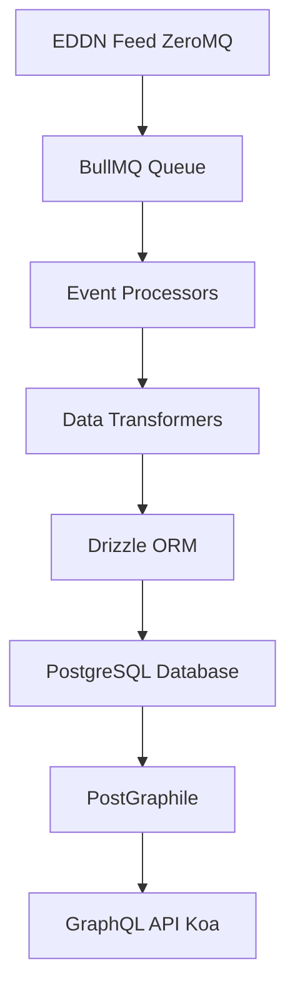

# EliteHub Vault

EliteHub Vault is a real-time data collection and processing system for Elite Dangerous. It subscribes to the [EDDN (Elite Dangerous Data Network)](https://github.com/EDCD/EDDN) feed, processes player-submitted events, and stores game state in a PostgreSQL database with a GraphQL API layer powered by PostGraphile.

Support the development of this project by [buying me a coffee](https://buymeacoffee.com/jovanblazek).

[](https://buymeacoffee.com/jovanblazek)

## Table of Contents

- [Why another data collection system?](#why-another-data-collection-system)
- [Usage For API Consumers](#usage-for-api-consumers)
  - [Authentication](#authentication)
  - [Rate Limits](#rate-limits)
  - [GraphQL Endpoint](#graphql-endpoint)
  - [Example Queries](#example-queries)
  - [Support](#support)
- [For Contributors](#for-contributors)
- [Roadmap](#roadmap)
- [License](#license)
- [Credits](#credits)

## Why another data collection system?

There are already several websites and services for Elite Dangerous that provide similar data and functionality. However, most of them lack an API for BGS related data that is comprehensive and well documented.

After EliteBGS started to have frequent availability issues with their API, I decided to build my own data collection system and API.

## Usage For API Consumers

EliteHub Vault provides a **read-only GraphQL API** with real-time Elite Dangerous galaxy data, including systems, factions, stations, powerplay information, and conflicts.

### Authentication

All API requests require an **API key** in the `X-API-Key` header:

```bash
curl -H "X-API-Key: your-api-key" https://your-endpoint/graphql
```

Contact [jovanblazek](https://github.com/jovanblazek) on Discord, username: qwerty22, or create an [issue](https://github.com/jovanblazek/elitehub-vault/issues/new) to obtain an API key.

### Rate Limits

- **60 requests per minute** per API key (subject to change)
- Rate limit headers included in responses

### GraphQL Endpoint

```
POST /graphql
GET /graphql (for GraphiQL playground)
```

### Example Queries

<!-- TODO: Add example queries -->

### Support

For API issues or questions, please open an [issue](https://github.com/jovanblazek/elitehub-vault/issues/new).

---

## For Contributors

### Prerequisites

- **Node.js** 22.14.0 or higher
- **pnpm** 9.x or higher
- **Docker** and Docker Compose (for local database)

### Quick Start

1. **Clone the repository:**

   ```bash
   git clone https://github.com/jovanblazek/elitehub-vault.git
   cd elitehub-vault
   ```

2. **Install dependencies:**

   ```bash
   pnpm install
   ```

3. **Set up environment:**

   ```bash
   cp .env.example .env
   # Edit .env with your configuration
   ```

4. **Start database services:**

   ```bash
   pnpm docker:up
   ```

5. **Run database migrations:**

   ```bash
   pnpm drizzle:migrate
   ```

6. **Start development server:**
   ```bash
   pnpm dev
   ```

The GraphQL API will be available at `http://localhost:3000/graphql`. Replace the port with the one specified in your `.env` file.

### Development Commands

```bash
pnpm dev                 # Run in watch mode with hot reload
pnpm typecheck           # Type check the code
pnpm build               # Build for production
pnpm start               # Run production build
pnpm format              # Format all code with Prettier
pnpm lint                # Lint code with Oxlint
pnpm lint:fix            # Auto-fix linting issues

# Database
pnpm drizzle:generate    # Generate migrations from schema changes
pnpm drizzle:migrate     # Run pending migrations
pnpm drizzle:studio      # Open Drizzle Studio (visual database explorer)

# Docker
pnpm docker:up           # Start PostgreSQL + Redis
pnpm docker:down         # Stop services
```

### Architecture Overview



**Component Responsibilities:**

- `src/index.ts` - Application entry point, Koa server setup
- `src/eddn/` - EDDN data ingestion via ZeroMQ
- `src/mq/queues/eddn/` - BullMQ worker and event processing
- `src/mq/queues/eddn/events/` - Event-specific processors (FSDJump, Location, Docked)
- `src/mq/queues/eddn/helpers/` - Data transformation logic
- `src/db/schema.ts` - Drizzle ORM database schema
- `src/postgraphile/` - PostGraphile configuration and plugins

### Code Style

- Use **ES modules** (`.js` extensions in imports, even for `.ts` files)
- **Destructure imports** when possible: `import { foo } from 'bar'`
- Logger available as `import logger from './utils/logger.js'`
- **Prefix logs** with component name: `logger.info('[ComponentName] Message')`
- **All database operations** via Drizzle ORM
- Use `db.transaction()` for multi-step database operations
- Run lint and format commands before committing

### Workflow

1. Make your changes
2. Run `pnpm typecheck` to verify types
3. Test your changes locally, using `pnpm dev`
4. Run `pnpm lint` and `pnpm format` to check for linting and formatting errors
5. Commit with descriptive messages

When done, open a pull request to the main branch.

### Database Migrations

When done modifying the schema in `src/db/schema.ts`:

1. **Generate migration:**

   ```bash
   pnpm drizzle:generate
   ```

2. **Review generated SQL** in `drizzle/` directory. Update if necessary.

3. **Run migration:**

   ```bash
   pnpm drizzle:migrate
   ```

4. **Commit both** `schema.ts` and generated migration files

### Tech Stack

- **Koa** - HTTP server
- **PostGraphile** - GraphQL API auto-generation
- **Drizzle ORM** - Type-safe database operations
- **BullMQ** - Redis-backed job queue
- **ZeroMQ** - EDDN data subscription
- **PostgreSQL** - Primary database
- **Redis** - Queue backend and rate limiting
- **TypeScript** - Type safety
- **Pino** - Structured logging
- **Sentry** - Error tracking

### Testing

We don't have any tests yet. YOLO.
Feel free to add meaningful tests though.

### Contributing Guidelines

1. **Fork the repository** and create a feature branch
2. **Follow code style** guidelines (see README.md and CLAUDE.md)
3. **Write clear commit messages**
4. **Run typecheck** before submitting
5. **Run lint and format** to check for linting and formatting errors
6. **Submit a pull request** with description of changes

#### PR Title Format Requirements

This project uses [Conventional Commits](https://www.conventionalcommits.org/) for automated versioning and changelog generation. **All PR titles must follow this format:**

```
<type>[optional scope]: <description>
```

**Allowed types:**

- `feat`: New feature
- `fix`: Bug fix
- `docs`: Documentation changes
- `style`: Code style changes (formatting, missing semicolons, etc.)
- `refactor`: Code refactoring without changing functionality
- `perf`: Performance improvements
- `test`: Adding or updating tests
- `build`: Build system or external dependency changes
- `ci`: CI/CD configuration changes
- `chore`: Maintenance tasks (don't trigger releases)
- `revert`: Reverting previous changes

**Breaking changes:** Add `BREAKING CHANGE:` in the PR description to trigger a **major** version bump (e.g., 1.0.0 → 2.0.0).

**Valid PR title examples:**

- `feat: add user authentication`
- `fix: resolve database connection timeout`
- `docs: update API examples in README`
- `refactor(eddn): simplify event processing logic`
- `perf: optimize station lookup queries`

**Invalid PR titles:**

- `Add new feature` (missing type)
- `feat add feature` (missing colon)
- `feature: add thing` (wrong type name)

PR titles are validated automatically. If your PR title doesn't match the format, the CI check will fail.

### Environment Variables

See `.env.example` for all available configuration options. Key variables:

- `PORT` - HTTP server port (default: 3000)
- `LOG_LEVEL` - Logging level (debug, info, warn, error)
- `DEBUG_EDDN_LISTENER` - Set to `true` to enable EDDN listener in development mode
- `SENTRY_DSN` - Error tracking (optional)

The rest should be self-explanatory from the example file.

### Resources

- [EDDN GitHub](https://github.com/EDCD/EDDN)
- [Elite Dangerous Journal Schemas](https://jixxed.github.io/ed-journal-schemas/index.html)
- [PostGraphile Documentation](https://postgraphile.org/)
- [Drizzle ORM Documentation](https://orm.drizzle.team/)

---

## Roadmap

- [ ] Truncate the database to get rid of invalid old data
- [ ] Process stronghold carriers and megaships. Remove them when they are not present in the FSSSignalDiscovered event or update their location when they appear somewhere else.
- [ ] Add mechanism to remove stations that are not present in the FSSSignalDiscovered event. Stations may be demolished in colonized systems.

---

## License

[GPL-3.0](./LICENSE)

## Credits

Data sourced from the Elite Dangerous Data Network (EDDN), contributed by thousands of Elite Dangerous players.

Constants and other useful data types inspired by [EDSM](https://github.com/EDSM-NET/Alias), [Spansh](https://spansh.co.uk/) and [EliteBGS](https://github.com/elite-kode/elitebgs).
