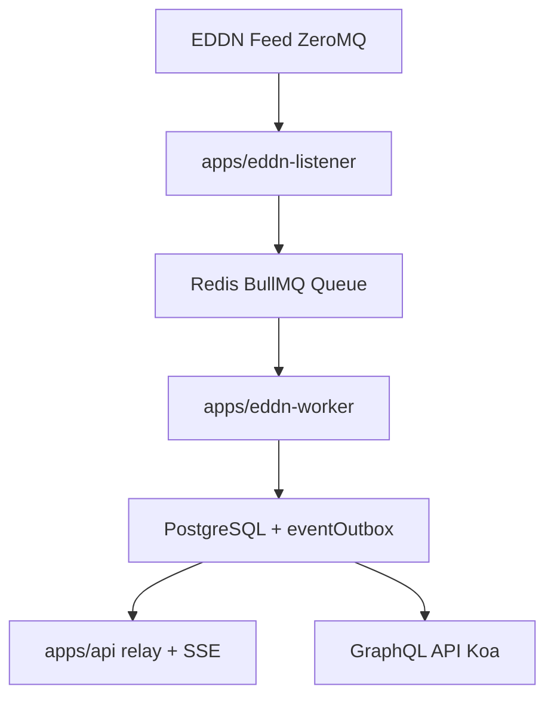

# Architecture

This document summarizes the runtime architecture at a high level.

## Monorepo Components

- `apps/api` - Koa API, PostGraphile integration, auth, SSE, and realtime relay
- `apps/eddn-listener` - subscribes to EDDN (ZeroMQ) and enqueues jobs to BullMQ
- `apps/eddn-worker` - consumes queue jobs and writes state into PostgreSQL
- `packages/db` - shared Drizzle schema and migrations
- `packages/eddn-contracts` - shared EDDN message types and filters
- `packages/queue-contracts` - shared queue and realtime payload contracts
- `packages/runtime-config` - shared env/logging/Redis/Sentry helpers

## Data Pipeline

## Realtime SSE Pipeline

1. Worker processors write realtime candidates into `eventOutbox`.
2. API relay reads outbox rows and publishes to Redis channels.
3. SSE connections subscribe by event type and routing key.
4. Broker fans out matching events to connected clients.

## Realtime Event Scope

- Endpoint: `GET /realtime/sse`
- Auth: API key required (`X-API-Key`)
- Supported event types:
  - `systemPowerplayUpdated`
  - `factionPresenceChanged`
  - `factionStateChanged`
  - `factionControlThreatChanged`
- Routing keys:
  - `powerId` for `systemPowerplayUpdated`
  - `factionId` for faction events
- Optional narrowing: `systemId` filters

For payload-level details, examples, and semantics, see [docs/sse.md](sse.md).
