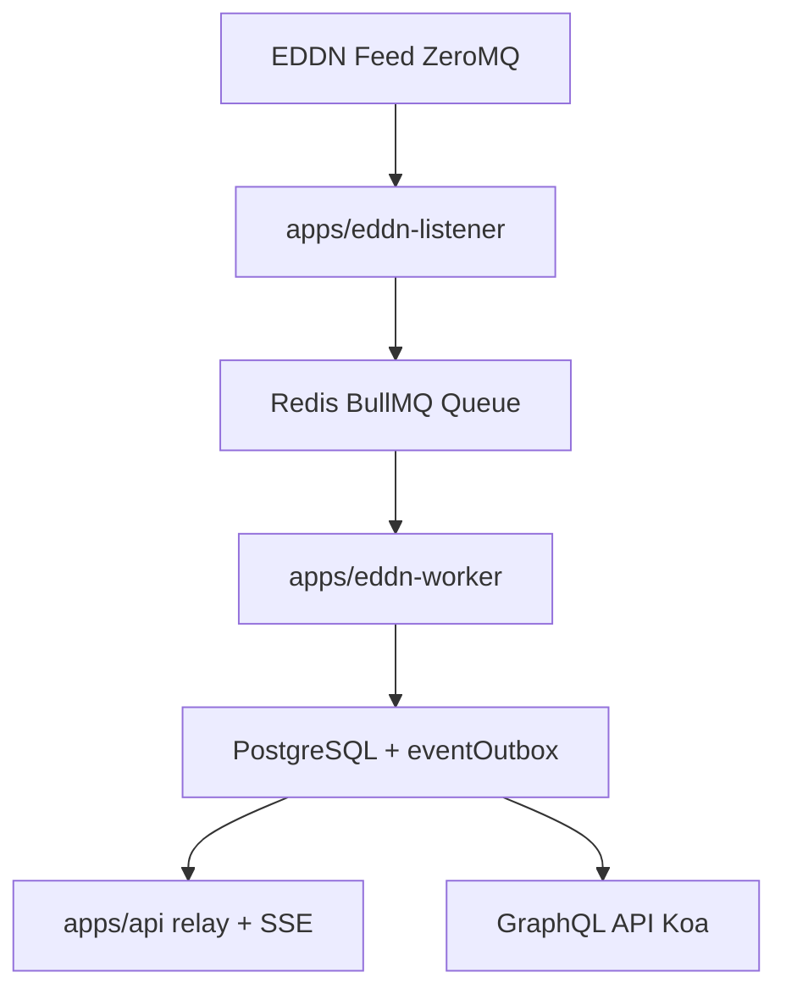

# Contributors

This repository uses a Turborepo monorepo with applications under `apps/*` and shared libraries under `packages/*`.

## Prerequisites

- **Node.js** 22.14.0 or higher
- **pnpm** 9.x or higher
- **Docker** and Docker Compose (for local database)

## Quick Start

1. **Clone the repository:**

   ```bash
   git clone https://github.com/jovanblazek/elitehub-vault.git
   cd elitehub-vault
   ```

2. **Install dependencies:**

   ```bash
   pnpm install
   ```

3. **Set up environment:**

   ```bash
   cp .env.example .env
   # Edit .env with your configuration
   ```

4. **Start database services:**

   ```bash
   pnpm docker:up
   ```

5. **Run database migrations:**

   ```bash
   pnpm drizzle:migrate
   ```

6. **Start development pipeline:**

   ```bash
   pnpm dev
   ```

`pnpm dev` runs the development pipeline through Turbo. In practice, that starts the three apps and any shared packages that they depend on.

The GraphQL API will be available at `http://localhost:3000/graphql`. Replace the port with the one specified in your `.env` file.

## Development Commands

```bash
pnpm dev                 # Run all workspace dev tasks through Turbo
pnpm dev:api             # Run apps/api and its local dependencies
pnpm dev:eddn-listener   # Run apps/eddn-listener and its local dependencies
pnpm dev:eddn-worker     # Run apps/eddn-worker and its local dependencies
pnpm typecheck           # Type check the code
pnpm build               # Build all apps and packages
pnpm format              # Format all code with Prettier
pnpm lint                # Lint code with Oxlint
pnpm drizzle:generate    # Delegate to packages/db and generate migrations
pnpm drizzle:migrate     # Delegate to packages/db and run migrations
pnpm drizzle:studio      # Delegate to packages/db and open Drizzle Studio

# Docker
pnpm docker:up           # Start PostgreSQL + Redis
pnpm docker:down         # Stop services
```

## Architecture Overview



**Component Responsibilities:**

- `apps/api/` - Koa API, PostGraphile, SSE, auth, and outbox relay
- `apps/eddn-listener/` - EDDN listener application that consumes ZeroMQ messages and enqueues BullMQ jobs
- `apps/eddn-worker/` - worker application that processes BullMQ jobs and updates the database
- `packages/db/` - shared Drizzle schema, migrations, and DB helpers
- `packages/eddn-contracts/` - shared EDDN message types and filters
- `packages/queue-contracts/` - shared queue names, job payloads, and realtime contracts
- `packages/runtime-config/` - shared env loading, Redis, logger, and Sentry factories
- `packages/typescript-config/` - shared base TypeScript config

## Code Style

- Use **ES modules** (`.js` extensions in imports, even for `.ts` files)
- **Destructure imports** when possible: `import { foo } from 'bar'`
- Create process-local runtime instances from shared factories; do not share live Redis/BullMQ/DB instances across apps
- **Prefix logs** with component name: `logger.info('[ComponentName] Message')`
- **All database operations** via Drizzle ORM
- Use `db.transaction()` for multi-step database operations
- Run lint and format commands before committing

## Workflow

1. Make your changes
2. Run `pnpm typecheck` to verify types
3. Test your changes locally, using `pnpm dev`
4. Run `pnpm lint` and `pnpm format` to check for linting and formatting errors
5. Commit with descriptive messages

When done, open a pull request to the main branch.

## Database Migrations

Database commands are owned by `packages/db`. You can run them either from the workspace root via the convenience wrappers in `package.json`, or directly inside `packages/db`.

When done modifying the schema in `packages/db/src/schema.ts`:

1. **Generate migration:**

   ```bash
   pnpm drizzle:generate
   ```

   Equivalent direct package command:
   `cd packages/db && pnpm drizzle:generate`

2. **Review generated SQL** in `packages/db/drizzle/` directory. Update if necessary.

3. **Run migration:**

   ```bash
   pnpm drizzle:migrate
   ```

   Equivalent direct package command:
   `cd packages/db && pnpm drizzle:migrate`

4. **Open Drizzle Studio if needed:**

   ```bash
   pnpm drizzle:studio
   ```

   Equivalent direct package command:
   `cd packages/db && pnpm drizzle:studio`

5. **Commit both** `packages/db/src/schema.ts` and generated migration files

## Tech Stack

- **Koa** - HTTP server
- **PostGraphile** - GraphQL API auto-generation
- **Drizzle ORM** - Type-safe database operations
- **BullMQ** - Redis-backed job queue
- **ZeroMQ** - EDDN data subscription
- **PostgreSQL** - Primary database
- **Redis** - Queue backend and rate limiting
- **TypeScript** - Type safety
- **Pino** - Structured logging
- **Sentry** - Error tracking

## Testing

Current automated tests live in `apps/api/src/**/*.test.ts` and run via `pnpm test`.

## Contributing Guidelines

1. **Fork the repository** and create a feature branch
2. **Follow code style** guidelines (see README.md and CLAUDE.md)
3. **Write clear commit messages**
4. **Run typecheck** before submitting
5. **Run lint and format** to check for linting and formatting errors
6. **Submit a pull request** with description of changes

## Environment Variables

See `.env.example` for all available configuration options. Key variables:

- `PORT` - HTTP server port (default: 3000)
- `LOG_LEVEL` - Logging level (debug, info, warn, error)
- `SENTRY_DSN_API` - API Sentry DSN (optional)
- `SENTRY_DSN_EDDN_WORKER` - EDDN worker Sentry DSN (optional)
- `SENTRY_DSN_EDDN_LISTENER` - EDDN listener Sentry DSN (optional)

The rest should be self-explanatory from the example file.

## Resources

- [EDDN GitHub](https://github.com/EDCD/EDDN)
- [Elite Dangerous Journal Schemas](https://jixxed.github.io/ed-journal-schemas/index.html)
- [PostGraphile Documentation](https://postgraphile.org/)
- [Drizzle ORM Documentation](https://orm.drizzle.team/)
